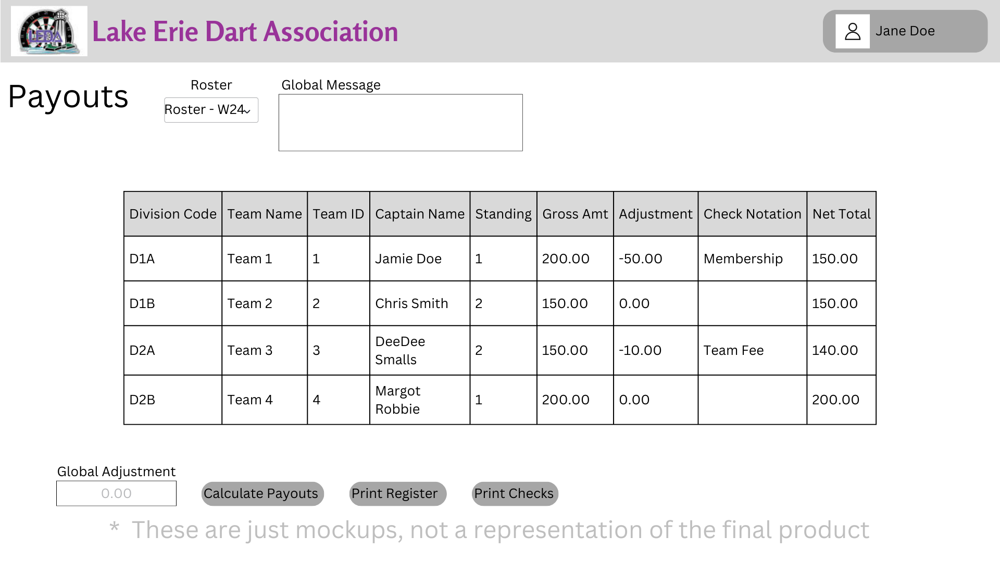

# Design for Payouts
This design is to implement the functionality for payouts, with this you will be able to view, edit, and export payouts.

## Creating a PostgreSQL table
table name: leda_payouts
columns: id* int, seasonCode str, teamId int, grossAmmt double, adjustment int, checkNotation str, netAmmt double

## Viewing Payouts
Under the activies section you will find a link named Payouts, when clicking this link the user will be brought to the payouts page.

In this page you can select a season, and then all teams will be displayed, along with their captains, their place, gross winnings, adjustments, notes, and then a net total

## Editing Payouts
After a season is selected you will be able to edit the current place of a team, along with any adjustments/notes on a team.
 
You can do this by clicking the Edit Payouts button

After editing, you can click save and it will update the database with the new information

There will also be an option to do a global adjustment, which will afftect all teams.

Place payouts will be determined from the Payout Tiers design

## Export Payouts
There will be two different forms avaliable for exporting:

1. Checks - This will create checks for each team with their net amount

2. Register - This will create a summary report for all payouts for the teams

# Mockups
## Payouts Page
