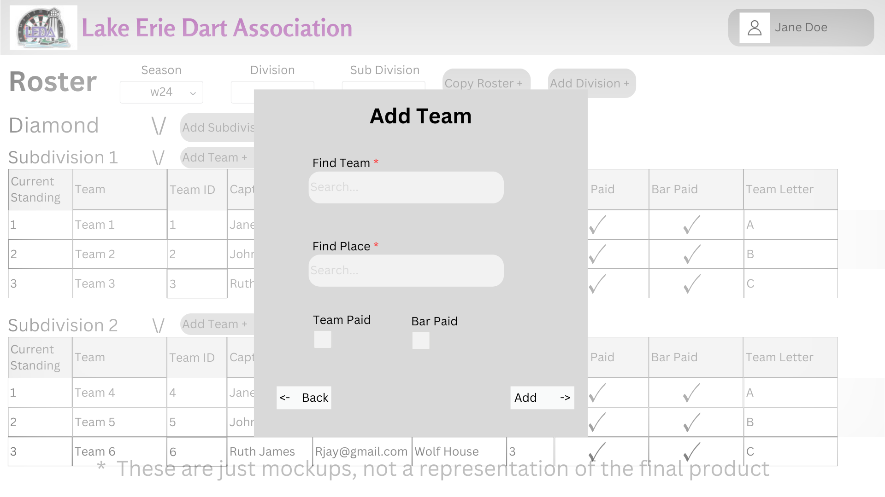

# Design for Rosters
The purpose of this design is to implement the functionality to support Rosters, with this you will be able to view, edit, add, copy, or delete a roster.

## Create a table in PostgreSQL

table name: leda_roster_info

Columns: id int, seasonCode str, teamIds string

seasonCode comes from table leda_maint_seasons

teamId comes from leda_team_info

## View a roster
Under the activies header there will be a link called Roster, when clicked on it will bring you to the Rosters page, when you enter select the Season Code you are looking for it will pull up the roster for that season.

*A list of the season codes will be obtained from the leda_maint_seasons table

Once a roster has been selected you will be able to see the information from a team, like division information, teamId, team name, bar id, bar name, if the team/bar paid any notes, the option to view the players on that team.

Division information will look like this: S1A or Sapphire, sub division 1, team letter A and all information from the table leda_schedule_information

If you view players it will show you Player Id, Name (Dickard, Tyler), Paid Status, Captain, Bad Standing, and Cannot Be Captain. You will also have the ability to delete or add players to the selected team. All of this information will come from the table leda_player_info and leda_membership_info

## Add to a roster
If a roster has not been created yet for a season you will be able to add divisions and subdivisons and start adding teams.

Once the add team button is pressed you will be able to select the division and subdivision of the team. Then you will be able to add the place information for their home location. Then when the user clicks add it will add that team to the roster.

## Editing a roster
You can drag and drop teams from one subsection to another, it will also automatically reassign the team letter around the change.

ex: say you want to move a team from subsection 1 to subsection 2, and its letter in 1 is B but you want it to be C in subsection 2. When moved it will automatically shift the remaining teams to fill the gap of B and then update the entries in subsection 2, and the old C will become D, and so on so forth. 

The user will also be able to go and edit the bar location of a team by clicking on a team and clicking the edit button.

*This will auto update the schedule

You can also move entire subsections to another division, and they will adjust the numbers of the subsections and the division name automatically.

You can also change the division to another division, so say you accidentally created everything as Diamond, but actually wanted Emerald, you can change that and the teams will automatically update along with the schedule.

## Copy a roster
You can select a previous seasons roster to copy, for example if W25 is the same as W24 you can just open W24 and click the Copy Roster button and it will open a pop up for you to select which new season you would like to copy the roster to.
You can also create the season if it doesnt exist yet from this pop up

## Deleting from a roster/wiping the roster
You can delete a team, subdivison, or division from the roster and it will update the database with the removals.
You can also wipe the roster and delete every division, subdivision, and team from that seasons roster.  

# Mockups
## Rosters Page

## Add Team

## Add Division

## Copy Roster

