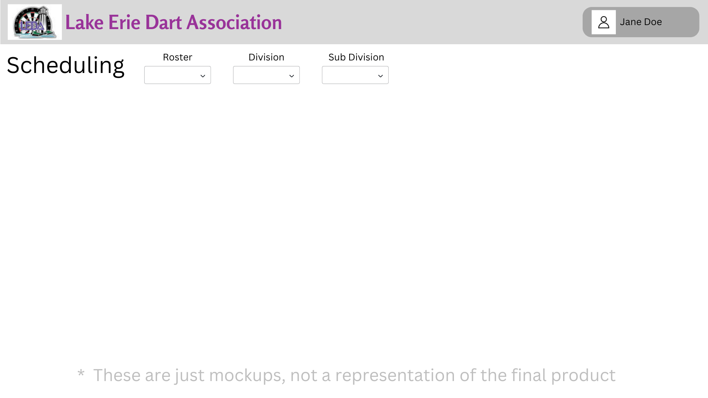
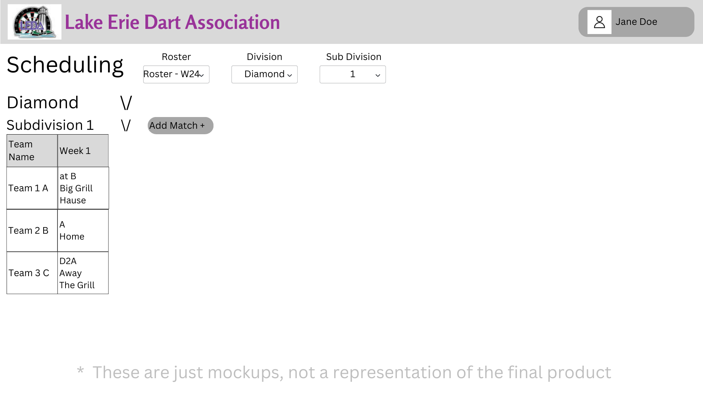
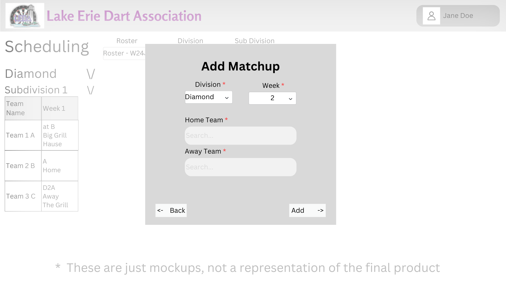

# Design for Scheduling
The purpose for this design is to add functionality to support schedules, the goal is to add the ability to view, create, edit, or delete a schedule.

## Creating a table in PostgreSQL
table name: leda_schedule

columns: id int, seasonCode str, rosterId int
___
table name: leda_schedule_team_info

column names: id int, rosterId int, teamId int, weekNum int, homeOrAway bool, oppTeamId int, matchDateTime date(MM-DD-YYYY HH:MM:SS)

## Viewing a schedule
When a user clicks on the Scheduling link under Activites a user will be directed to the schedule page. Once loaded into the page it will be mostly blank with a dropdown to select the roster the user wish to view the schedule for. 

It will by default load all weeks that were defined when the Season was created.

Once the roster has been selected the schedule will appear, by default a user will see the entire schedule for each division or subdivision. But the user will be able to change a setting which will always open the roster condenced. You can also always condense individual subdivisions or entire divisions within the schedule. 

You will be able to see each team within a subdivision/division and also see their entire schedule.

## Creating a schedule
If a schedule has not been created yet for a roster, when a user clicks on the roster to view the schedule it will pull up the divisions and sub divisions but not have any games displayed.

When a user wants to schedule a matchup for a week, they can drag one team to another, or click the Add Matchup button to schedule the teams to face eachother

*By default the team that was dragged to another team will be considered the away team, it is possible to change the home team.

**Also, the schedule will automatically update the dragged team to have the game on their schedule.

***There is also the ability to drag teams from another subdivision/division to face a team, i.e. if there are uneven teams in a subdivision to avoid a bye week, or something of that nature

## Editing a schedule
Once a roster is pulled up and the schedule is visiable a user can click the button named "Edit" to go into edit mode. 

In this mode they will be able to edit any teams matchup for any given week. 

Simply click on a match tile for a team and they will be able to edit that weeks matchup. You can change the home team, remove and add a new team to face, change the day/time of the match, or cancel the match (will put a red X through that week).

Once the user is done editing they will be able to click save and it will update the schedule in the database.

## Deleting a schedule
If there is a need to delete a schedule for a particular roster a user can view that particular schedule and click the Delete Schedule button. This will pull up a confirmation menu, if confirmed any data relating to the schedule will be deleted.

# Mockups
## Scheduling Blank

## Scheduling Selected

## Add Match

