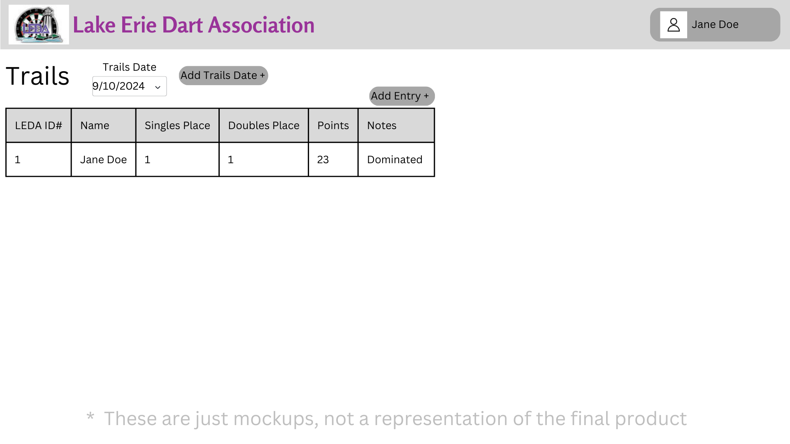
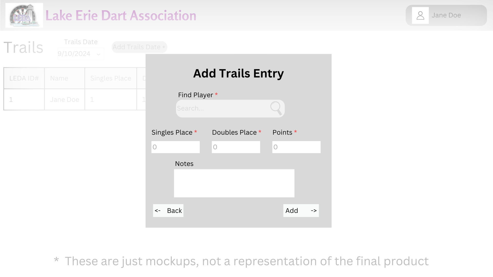
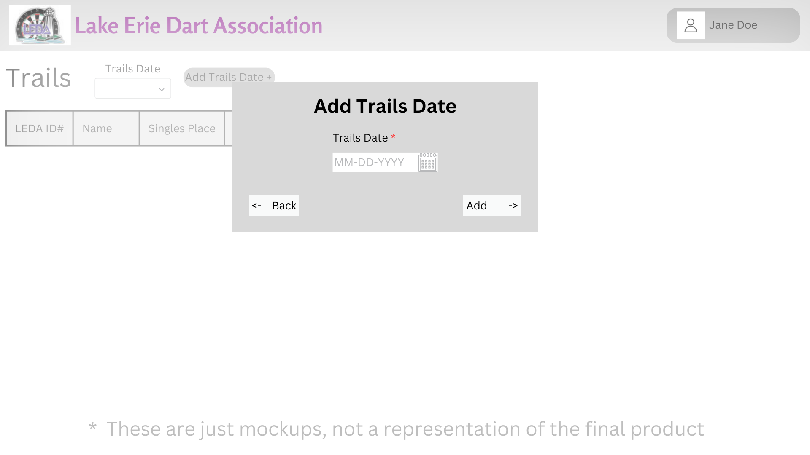

# Design for Trails
This design is to add functionality to support trails, this design will allow you to view, add, edit, or delete trails.

## Creating a PostgreSQL table
table name: leda_trails_history

Columns: id* int, playerId int, notes str, singlesPlace int, doublesPlace int, trailsPoints int, trailsDate date(MM/DD/YYYY)
___
table name: leda_trails_totals

columns: id* int, playerId int, previousTotalPoints int, totalPoints int

## Viewing trails scores
Under the Activites tab you will find a link named Trails, after clicking the link will bring you to the trails page.

Once you are on the trails page, you will be able to select a date. If there are trails scores that exist on that day it will display all players that played on that date, if there are no players that played on that date it will show as blank.

## Adding trails scores
When you select a trails date and are viewing the results from that page you can click the button that says Add Score, from there a menu will appear.

In this menu a user will select a player, then add information about their singles standing, doubles standing, and their points for that trail

Once the user clicks add it will add that player to that dates trail information.

## Editing trails scores
After a trails date has been selected, the user can select an individual players record and there will be an Edit Trails button

After clicked a menu with the existing data will appear

On the menu a user can edit any of the data and then click the save button, from there it will update the database.

## Deleting trails scores
After a trails date has been selected, the user can either delete the entire trails score sheet by clicking the Delete Trails Scores button, or the user can delete an individual score by selecting a player's record and clicking the Delete button.

After the button has been clicked a confirmation menu will appear, once confirmed the record(s) will be removed.

# Mockups
## Trails Page

## Trails Add Entry

## Trails Add Trails Date

