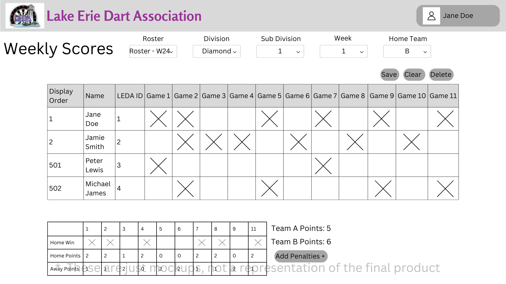
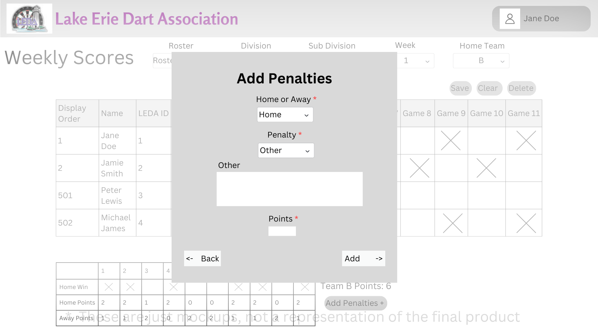

# Design for Weekly Scores
The purpose for this design is to implement the functionality to support Weekly Scores. With this design we will add the ability to view, create, edit, export, and delete score sheets

## Creating a PostgreSQL table
table name: leda_weekly_score

Columns: id int, seasonCode str, playerNumber int, weekNumber int, division str, subdivision int, homeOrAway char(1), homeTeamId int, awayTeamId int, displayOrder int*, gameInformation str**, wonGameInformation str-, pointsGameInformation str--, paidWeeklyFees bool, homeScore int, awayScore int

*displayOrder will be set for each team each week. If a team is home the display order will be set from the teams table. If the team is away the displayOrder will be the number from the teams table +500

**gameInformation this will be stored dynamically in a JSON format like this:
```
{
    game1: true,
    game2: false,
    game3: false
}
```
-wonGameInformation will be stored dynamically in a JSON format like this:
```
{
    game1: true, 
    game2: true, 
    game3: false
}
```
--pointsGameInformation will be store dynamically in a JSOn format like this:
```
{
    game1: 2,
    game2: 1,
    game3: 0
}
```

## Viewing a Weekly Score
Unter the activies tab, there will be a link named Weekly Scores, and when clicked it will bring you to a page that has the ability to show you a weekly score sheet.

When first loading into the page it will have some text boxes to fill with information. You will have to select the season (this will automatically select the roster) Then you will select the division (will automaitcally detect which divisions are in that roster), then the subdivision (will automatically detect how many subdivisions are in that division). After all of those selections it will then ask for you to select the home team, and from the list it will display all teams that are expected to play at home that week.

After selecting the home team a weekly scores sheet will be shown, from here you can view the exisiting score sheet or see a blank score sheet.

## Creating a Weekly Score
After you have started viewing a weekly score sheet, if one does not exist for that matchup it will automatically go into edit mode, which will allow you to input data into the form to add a score for that matchup for the week. 

The form will list out the players from each team (1-x for home) (501-x for away) in display order (this is set during team creation)

home team will have a background color of white for the player rows
away team will have a background color of dark grey for the player rows (possible dark mode, what colors would they be instead?)

When the user goes to enter in scores, you can click on the game tile for each player to mark it as an X, like in the old program, or click again to make it blank.

You will also be able to enter points for home/away team per game and be able to mark the game as a home win (if home win is not marked its an away win)

Once the user is done entering in the data they can hit save to update all records about that week.

You can also assign a player mentions, if a player has a mention it will add points to them (how does this system work? i cant figure out where the points go when it gets assigned)

## Editing a Weekly Score
Once the user is viewing a weekly score sheet, and it already existed, they can click the Edit button, once clicked the user will be able to make changes to any of the game tiles, or home/away points or home wins. 

When they are done making changes, they can click save and it will update the database with the updated data.

## Deleting a Weekly Score
Once a user is viewing a weekly score sheet they will have the option to delete a score sheet by clicking the Delete Weekly Score button, once clicked a confirmation menu will appear, if confirmed that scoresheet will be deleted.


# Mockups
## Weekly Scores Form

## Add Penalties

