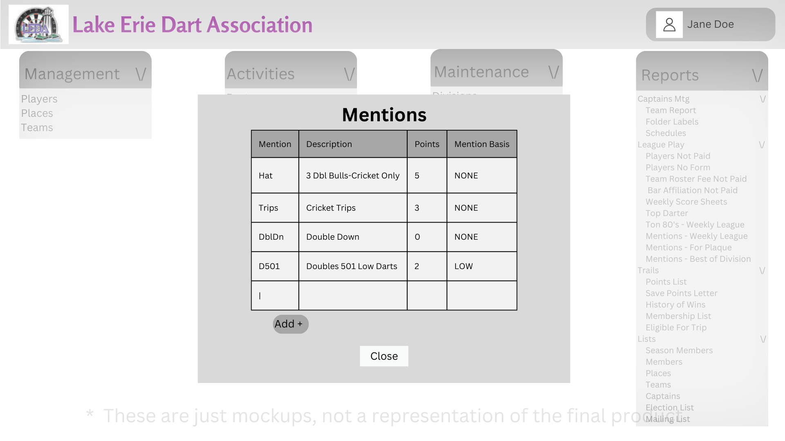

# Design for Mentions
The objective for this design is to implement the functionality of viewing, adding, editing, and deleting mentions

## Create a table in PostgreSQL
table name: leda_maint_mentions

Columns: id int, mentionCode str, desc str, points int, mentionBasis

## View mentions
Under the maintenance tab you will find a link named Mentions

When clicked, you will be brought to the mentions menu which will show all of the mentions.

## Add Mentions
In the mentions menu, in the right corner there is a button that says Add, when clicked a menu will appear which will have you enter information for the new mention

Required Fields: mentionCode, points, mentionBasis

## Edit Mentions
In the mentions menu, a user can select a particular mention and an edit button will become avaliable, click the edit button and a menu will appear and you will be able to edit any information about a mention.

Once saved it will update the data in the database.

## Delete Mentions
In the mentions menu, a user can select a mention and a delete button will appear, if selected a confirmation menu will appear, if confirmed it will be deleted from the menu and the database

# Mockups
## Mentions Page
