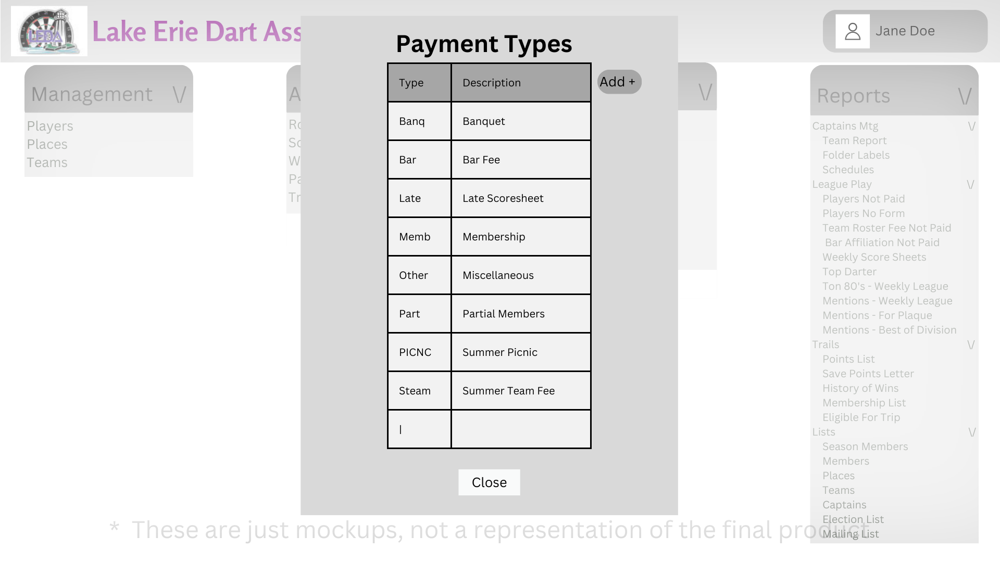

# Design for Payment Types
The objective for this design is to implement the functionality of viewing, adding, editing, and deleting Payment Types

## Create a table in PostgreSQL
table name: leda_maint_payment_types

Columns: id int, paymentType str, desc str

## View Payment Types
Under the maintenance tab you will find a link named Payment Types

When clicked, you will be brought to the Payment Types menu which will show all of the Payment Types.

## Add Payment Types
In the Payment Types menu, in the right corner there is a button that says Add, when clicked a menu will appear which will have you enter information for the new mention

Required Fields: mentionCode, points, mentionBasis

## Edit Payment Types
In the Payment Types menu, a user can select a particular mention and an edit button will become avaliable, click the edit button and a menu will appear and you will be able to edit any information about a mention.

Once saved it will update the data in the database.

## Delete Payment Types
In the Payment Types menu, a user can select a mention and a delete button will appear, if selected a confirmation menu will appear, if confirmed it will be deleted from the menu and the database

# Mockups
## Payout Types Page
