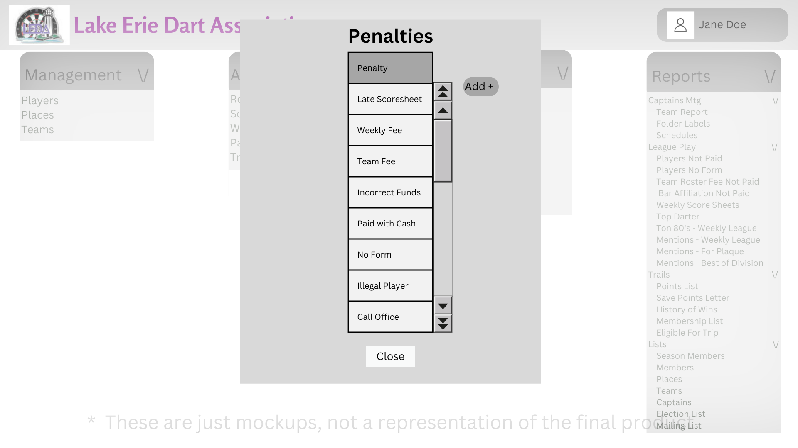

# Design for Penalties
The purpose of this design is to implement the functionality of penalties, with this design a user can add, edit, or delete penalties
## Create a PostgreSQL table
Table name: leda_maint_penalties

Columns: id int, penalty str, desc str

## View Penalties
Under the maintenance header there will be a link named Penalties, when clicked you will be taken to a menu which will show all of the penalties

## Add Penalties
While in the Penalties menu, there is a button called Add, when clicked a menu will appear in which you can add information pertaining to a Penalties

Required fields: penalty

## Edit Penalties
While in the Penalties menu you can click on a record, and click on the edit button which will pop up a menu and allow you to edit the Penalties

Once editing is done the user will be able to save and it will then update the database

## Delete Penalties
After you select a record in the people types menu you can see a delete button, clicking the delete button will pull up a confirmation prompt, if confirmed it will then delete the record from the table

# Mockups
## Penalties Page
