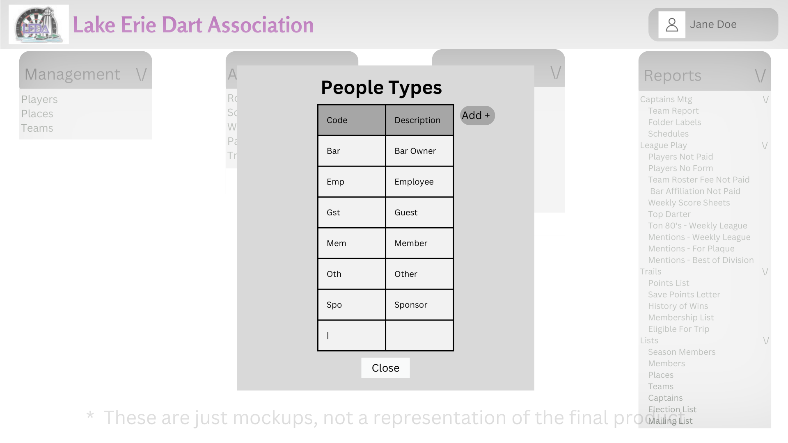

# Design for People Types
The purpose of this design is to implement the handling of People Types and add the functionality of viewing, adding, editing, and deleting People Types

## Create a PostgreSQL table
Table name: leda_maint_people_types

Columns: id int, peopleTypeCode str, desc str

## View People Types
Under the maintenance header there will be a link named People Types, when clicked you will be taken to a menu which will show all of the people types

## Add People Types
While in the People Types menu, there is a button called Add, when clicked a menu will appear in which you can add information pertaining to a People Type

Required fields: peopleTypeCode

## Edit People Types
While in the People Types menu you can click on a record, and click on the edit button which will pop up a menu and allow you to edit the people types

Once editing is done the user will be able to save and it will then update the database

## Delete People Types
After you select a record in the people types menu you can see a delete button, clicking the delete button will pull up a confirmation prompt, if confirmed it will then delete the record from the table

# Mockups
## People Types Page
