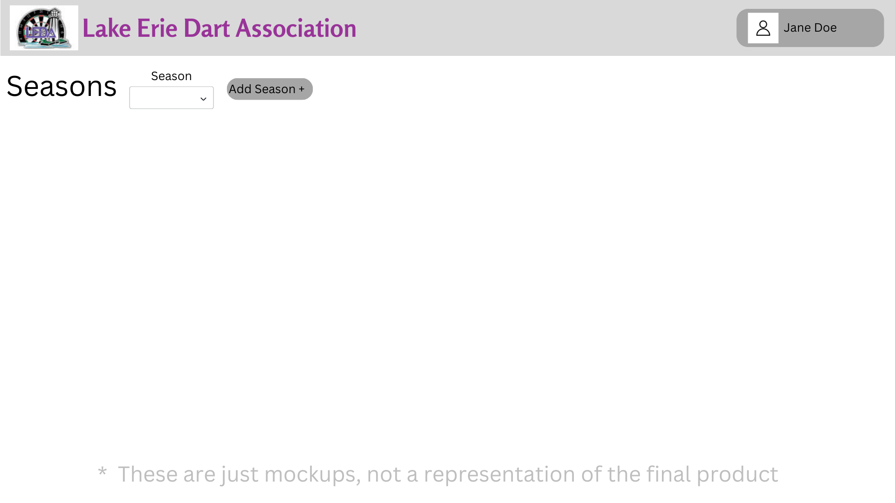
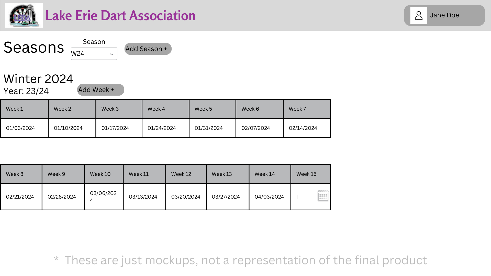

# Design for Seasons
The purpose for this design is to add functionality to handle seasons by being able to add seasons, edit seasons, or delete a season

## Create a table in PostgreSQL
table name: leda_maint_seasons
columns: id int, seasonCode str, description str, fiscalYear str, dates str*, isCurrentSeason bool

*dates will be stored as a json object, it will look like this:
{
    "game1":"1/1/2025",
    "game2:"1/5/2025"
}

## Season Tab
Under the maintenance header there will be a link named Seasons, click this and you will be brought to the management page for a season.

## Add a season
While in the season page, you can click the add button, this will popup with a page to add a new season. 

Required fields: seasonCode, fiscalYear, and dates

You will notice that in the add page for the dates, you can dynamically add them and remove them, to add click the plus under the dates portion and it will let you pick the date. dates will be numbered in ascending order so earliest date will be date1. You can add as much or as little dates as possible for a season*

*You need atleast one date to make a season.

## Edit a season
While in the season page, you can click the edit button, this will allow you to edit the data of a selected season.

Click save to update the table

## Delete a season
While in the season page, you can click the delete button. Once clicked a confirmation popup will appear, if confirmed remove the season from the db and all aspects that reference it.

# Mockups
## No Season Selected

## Season Selected

## Add Season
