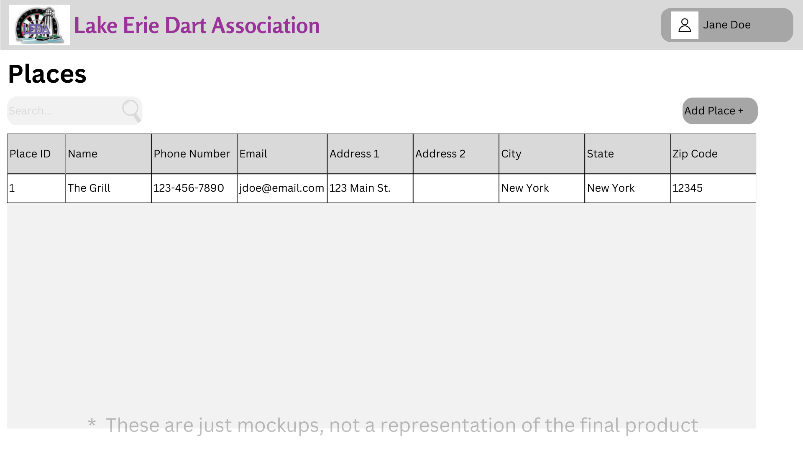
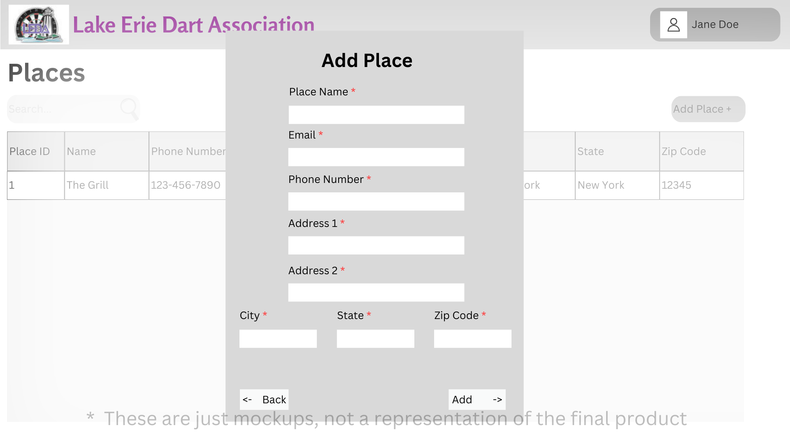

# Design for Places
The goal of this design is to implement the functionality to handle Places, i.e. Adding, editing, and deleting places.
## Creating the tables in PostgreSQL
Table name: leda_place_info
Columns: id int, name str, add1 str, add2 str, city str, state str, zip str, phoneNumber str, faxNumber str, email str, website str, establishDate date(MM-DD-YYYY), memo str, numberDartBoards int, sendMailings bool, regularSponsor bool, currentSponsor bool, issues bool, lastBarFeePayment str, lastSanctioningDate date(MM-DD-YYYY), contactId str, placeType str

*contactId links to idNumber in player table

## Adding Places
On the homepage right bellow the Places header, there will be a link called Add Place, when pressed will bring you to a page to enter information about the place.

Required fields: name, add1, city, state, zip, phoneNumber, establishDate, numberDartBoards, placeType
Default Values: sendMailings = false, regularSponsor = false, currentSponsor = false, issues = false

## Finding Places
On the homepage bellow the  Add Place button you will find a link to Find Place, which will allow you to search for a place

As the user types, search the table and dynamically return results around the typing

## Editing Places
After a place has been found, and you are taken to the place where it displays all of the information, an edit button will appear in the right hand side

When clicked, all of the information will appear in text boxes and become editable, once the user clicks save it will update the data in the database

## Deleting Places
After a place has been found, and you are taken to the place where it displays all of the information, a delete button will appear in the right hand side

When clicked, a confirmation box will appear, and if confirmed the data will be deleted from the table, aswell as become removed from any current teams associated with the place.

# Markups
## Places Page

## Add a place
