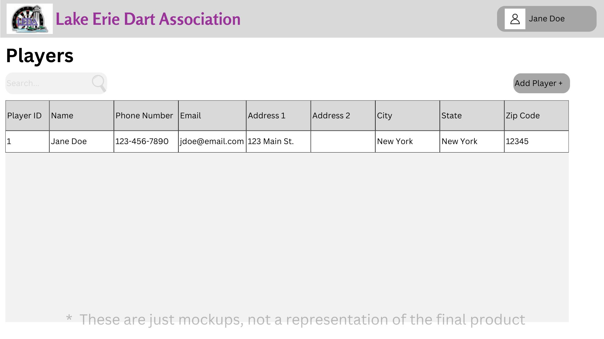
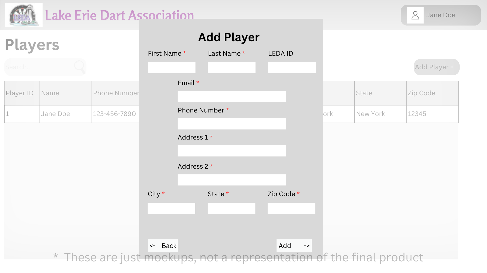

# Design for Players
The goal of this design is to implement functionality to handle the addition, deletion, editing, and more regarding players. This document is going to showcase the steps needed for this feature.
## Creating the tables in PostgreSQL
In pgadmin create a table with the name: leda_player_info
Columns: id* int, idNumber int, lastName str, firstName str, middleInitial char 1, addr1 str, addr2 str, city str, state str, zip str, phoneNumber str, faxNumber str, pagerNumber str, email str, gender str, dateOfBirth date(MM-DD-YYYY), cellPhoneNumber str

/\

|| idNumber will link these two tables

\\/

*id is just an interable, not the identification number
In pgAdmin create a table with the name: leda_membership_info
Columns: id* int, idNumber int, establishDate date(MM-DD-YYYY), badStanding bool, badStandingReason str, takeOffMailing bool, mailStandings bool, formOnFile bool, needsMemberCard bool, inactiveDate date(MM-DD-YYYY), lastMembershipFeePayment str, lastTrailsDate date(MM-DD-YYYY), memberType str, cannotBeCaptain bool, lifetimeMember bool, lifetimeMemberReason str

## Adding Players
In the main page a user is able to add players to the database, when a user is added require these fields:
player info: idNumber, lastName, firstName, addr1, city, state, zip, phoneNumber/cellPhoneNumber, gender, dateOfBirth
member info: idNumber, establishDate, needsMemberCard, lastMembershipFeePayment, memberType, formOnFile

Default values: badStanding = false, takeOffMailing = false, mailStandings = false, cannotBeCamptain = false, lifetimeMember = false, lastMembershipFeePayment = current membership period i.e. 2425 or 2324

## Finding Players
On the main page under players section, there will be a link to a page called Find Players, in this section you will be able to search for a player by using their idNumber, firstName, lastName, pretty much any field

As the user types, search the table and suggest matching results to the user

## Editing Players
After a player has been found, it will pull up a page that has all of that players information, in the top right of the page there will be a button called Edit, which will allow you to edit a players information.

Once the changes have been made the user can click the save button, which will then update the database

## Deleting Players
After a player has been found, it will pull up a page that has all of that players information, in the top right of the page there will be a button called Delete, which will allow you to delete a players information.

If the button is clicked a confirmation prompt will appear and if then confirmed the data will then be deleted from the database, and will be removed from anything that correlates to this table

# Mockup Images
## Players Page

*Will show all players, will be able to search

*When you click on a player row you will be able to edit/delete a player

*The user can also click on a field to sort them by ascending/descending order

## Adding Players
