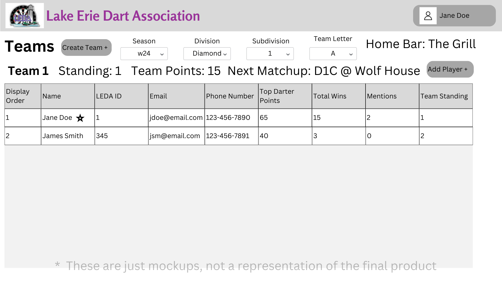
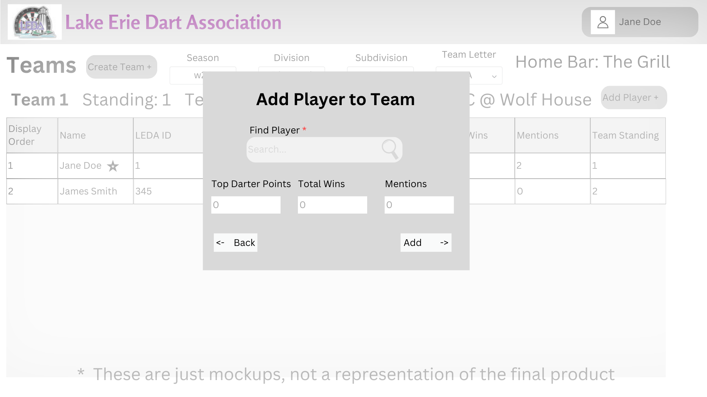
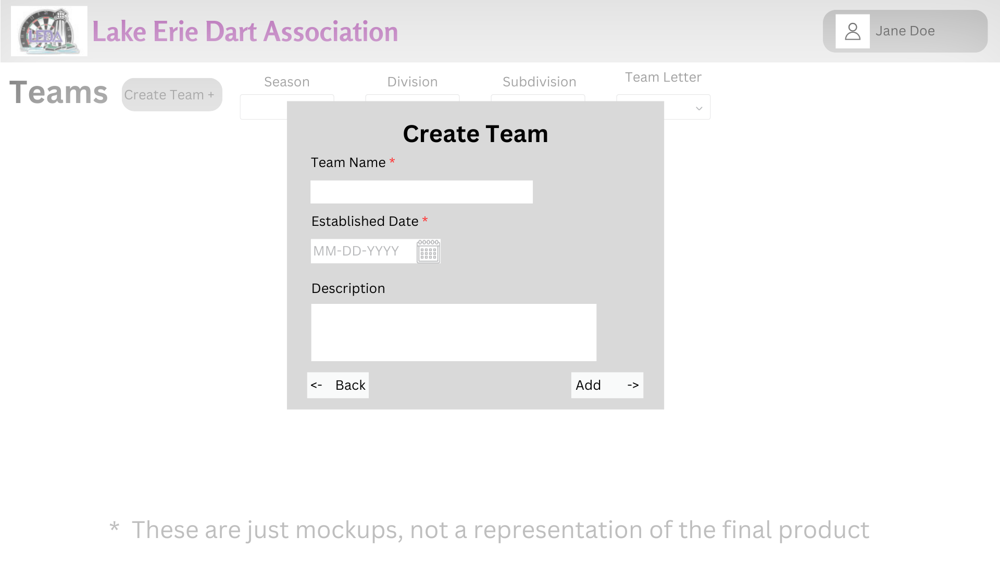

# Design for Teams
The goal of this design is to implement the functionality to handle teams, by being able to create, copy, edit, and delete teams.
Also the ability to add, remove, or changing the order of a player on a

## Create a table in PostgreSQL
Table Name: leda_team_info

Columns: id* int, idNumber int, teamName str, establishedDate date(MM-DD-YYYY), memo str, lastTeamFeePayment str
___
table name: leda_team_member_history

Columns: id* int, idNumber int, seasonCode, memberInfo str*, captainId int, barId int

*In memberInfo a record would look like this:
```
{
	"memberInformation": [{
		"playerId": 1234,
		"data": {
			"displayOrder": 1
		}
	}]
}
```
___
table name: leda_team_payout_info

columns: id int, seasonCode str, teamId int, payoutCheckAdjustedAmount number, payoutCheckAdjustmentReason str, payoutCheckGrossAmmount number, payoutCheckNumber int

seasonCode comes from table leda_maint_seasons

teamId comes from leda_team_info

## Viewing a team
When the user clicks on the Teams link and are on the teams page they will be able to see all teams

The user will also be able to search for (a) specific team(s) using the search bar, the page will dynamically show results as the user types

## Add a team
On the homepage under the Teams header, there will be a link named Add a Team, in this menu you will be provided all fields to create a team.

Required Fields: name, idNumber, establishedDate - will be option to set current day

While adding teams you must add atleast one member to the team, to add a member click the plus sign next to members and begin searching for the team member for that team.

When you select the result from the search that player will be added, if you want to make a player captain select the star next to the players name.

^ The same applies for places.

## Editing a team
After a team is found in the top left there will be an edit button, once clicked you will be able to edit a team.

You can edit any field of the team, and even remove players from the team.

If a player/place is deleted they will be removed from the team.

Once saved, the data in the database will be updated

## Deleting a team
After a team is found, in the top left there will be a delete button, if pressed a confirmation window will appear and if confirmed the team will be deleted from the database

## Adding a player to a team
After a team has been created, you can add players to a team. When viewing a team click the Add Players button, this will pull up a menu that will search for a player as you type and once selected you can click the Add button to add them to the team.

## Removing a player from a team
While viewing a team you can select a player and once selected you can click the red X next to their name to remove them, once clicked it will pop up a confirmation menu, and after that is confirmed it will remove the player from the team. 

## Setting the display order for a team
As a user while adding players to a team it will by default set the order in the order you add them (starting with 1), but you can drag a player up and down to change their order in the team

# Mockup Images
## Teams Page 

## Teams Page with selections


*To get to this page you can dynamically type to search for a team, once selected it will go to this page
## Adding Players

## Creating a team

