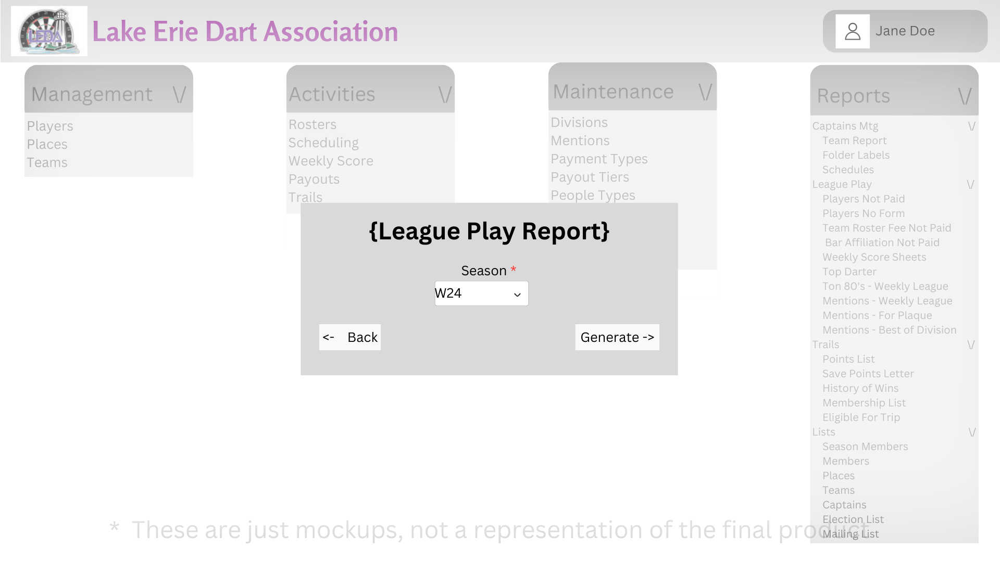
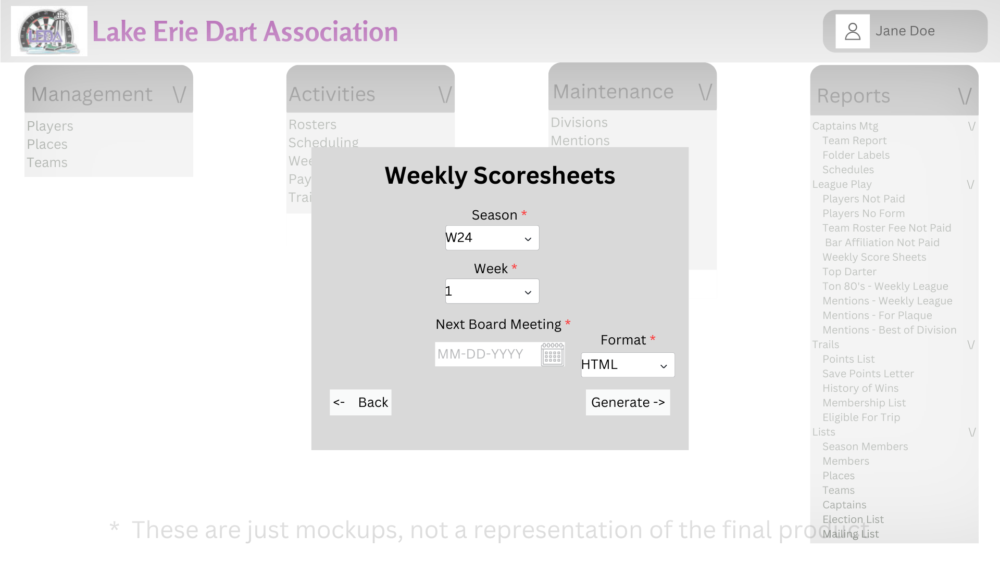
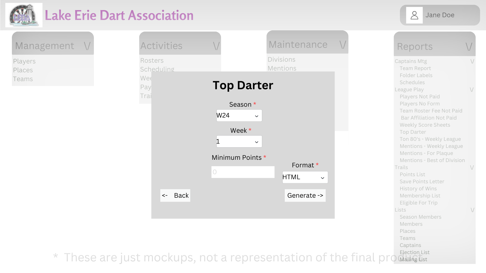
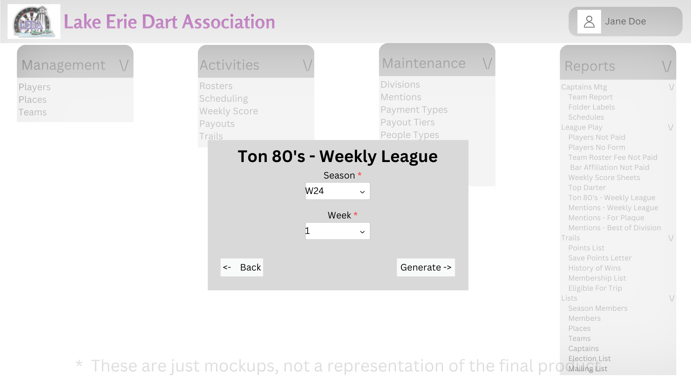
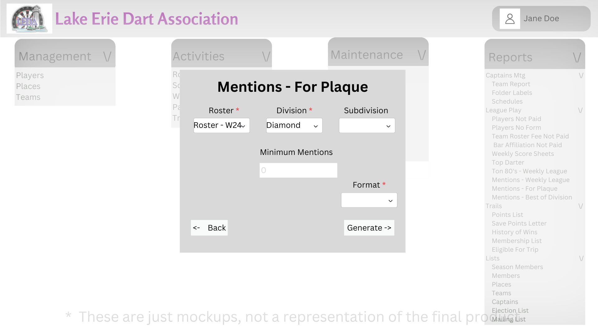

# Design for League Play
This design is intended to implement all of the reports for the Legue Play section

## Players Not Paid
Under the Reports Tab under the League Play subsection, you will find a link named Players Not Paid

Once a user clicks the link it will write a report that shows all players who have not paid in the current fiscal year, that information will include name and member id

## Players No Form
Under the Reports Tab under the League Play subsection, you will find a link named Players No Form

Once a user clicks the link it will write a report that shows all players who have not turned in their form for that season that information will include name and member id

## Team Roster Fee Not Paid
Under the Reports Tab under the League Play subsection, you will find a link named Team Roster Fee Not Paid

Once a user clicks the link it will write a report that shows all teams that have not paid their roster fee, that information will include team id, team name, bar id and division information

## Bar Affiliation Fee Not Paid
Under the Reports Tab under the League Play subsection, you will find a link named Bar Affiliation Fee Not Paid

Once a user clicks the link it will write a report that shows all of the bars that have not paid their affiliation fee for the selected fiscal year. It will include the bars name and its id.

## Weekly Scoresheets
Under the Reports Tab under the League Play subsection, you will find a link named Weekly Scoresheets

Once clicked you will be able to export the weekly score sheet totals for each team. It will export each division, subdivision, and teams within those, and have previous points, points earned, and total points, standings, and captain information.

## Top Darter
Under the Reports Tab under the League Play subsection, you will find a link named Top Darter

Once a user clicks the link they will be prompted to input a season and the week you want to calculate. Once selected it will generate a report that displays all names and their total top darter points for that week

## Ton 80's - Weekly League
Under the Reports Tab under the League Play subsection, you will find a link named Ton 80's - Weekly League

Once a user clicks the link it will prompt to select a week and then generate a report showing all players and their id's and the total times they scored a Ton 80

## Mentions - Weekly League
Under the Reports Tab under the League Play subsection, you will find a link named Mentions - Weekly League

Once a user clicks the link it will write a report that shows the amount of mentions per player and will be seperated by weeks.

## Mentions - For Plaques 
Under the Reports Tab under the League Play subsection, you will find a link named Mentions - For Plaques

Once a user clicks the link it will prompt a user to enter the season, division, and subdivision (all by default), and minimum amount of mentions needed to get a plaque. 

Once generated it will show all of the players that meet the number of mentions to get a plaque

## Mentions - Best of Division
Under the Reports Tab under the League Play subsection, you will find a link named Mentions - Best of Division

Once a user clicks the link it will prompt the user to select the season, from there it will select the top user from each division for each mention (if nobody for a mention dont write it) it will then write the mention name, player number, player name, team name, total mentions, and probability of getting the mention. 

If there are multiple people with equal mentions for a mention they will all appear.

