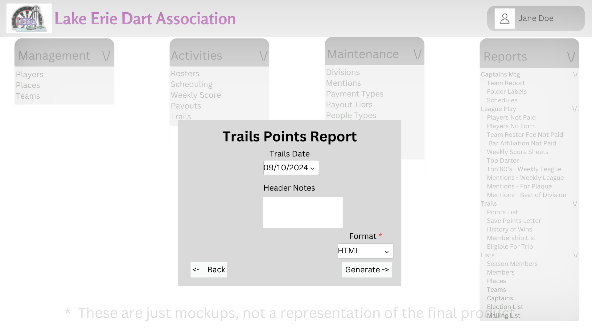

# Design for Trails Reports
The purpose of this design is to implement the reports for trails

## Points List
Under the Reports Tab under the Trails subsection, you will find a link named Points List. When clicked on the user will be prompted to select the trails date.

After a trails date is selected you can then set a header note, and then the format (pdf, html)

Once the user clicks generate it will show a report that will display all users in the trails

The report will show their name, previous points total, points scored, total points, last date played

If a player has not paid their dues it will put an X next to their name

## Save Points Letter
Under the Reports Tab under the Trails subsection, you will find a link named Save Points Letter. When clicked on the user will be prompted to select the currnet trails date

Any user that has participated in trails that hasnt participated in a trails event in 4 months or more will be eligable for the save points letter.

Once the user clicks generate it will generate a letter for each user that meets that criteria

## History of Wins
Under the Reports Tab under the Trails subsection, you will find a link named History of Wins. When clicked on the user will be prompted to select a date range.

After the date range, when the user clicks generate the report will be generated and will show the placings for singles/doubles for all trails members over that time range. 
*Results will be shown in highest numeber of 1st placements of singles

## Membership List 
Under the Reports Tab under the Trails subsection, you will find a link named Membership List. When clicked on it will prompt the user to confirm the generation

Once confirmed, it will generate a list of all users that are trails members, it will be formatted as:
{id} {name}

## Eligible for Trip
Under the Reports Tab under the Trails subsection, you will find a link named Eligible for Trip. When clicked you will be prompted to enter the minimum amount of points needed to get a trip. 

Once the user clicks Generate it will display all players that have the set points or more for a trip. it will inclide
name, total points, address information

